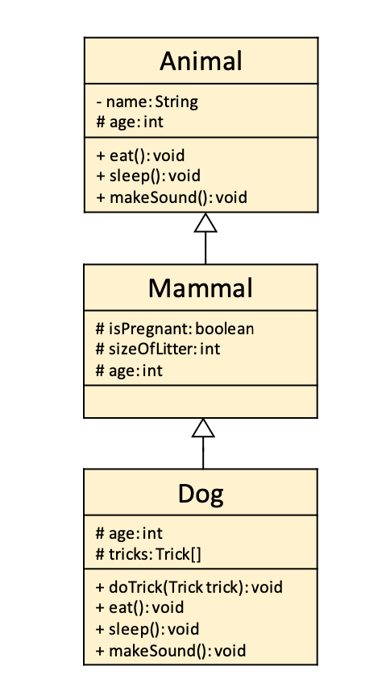

# Week 7


---
# Todays Topics:
- Enums
- Inner Classes
- Inheritance
- Interfaces
- Abstract Classes 
- Polymorphy
---
### Enums
- Used for a fixed set of named values/constants

- Useful to be more expressive in your code!
```java
public enum Direction2D {
    UP,
    DOWN,
    LEFT,
    RIGHT,
}
```
---
#### Example 
```java
class Penguin {

    public enum Direction2D {...}

    Direction2D direction = Direction2D.UP;

    void turnLeft() {
        switch (this.direction) {
            case UP -> this.direction = Direction2D.LEFT;

            case LEFT -> this.direction = Direction2D.DOWN;

            case DOWN -> this.direction = Direction2D.RIGHT;

            case RIGHT -> this.direction = Direction2D.UP;
        }
    }
}
```

---
### Overview: Inner Classes 
- You can put classes inside of classes

- The **outer** class can access the private Attributes/Methods of the **inner** class

- Make the inner class static and they can exist independant from the outer class

- Useful for even better Data-Encapsulation (e.g. LinkedList)

---

### Inner Classes 
- You can put classes inside of classes

```java
class Outer {
    
    /*..code..*/

    class Inner {
        /*..code..*/
    }
}
```

---
### Inner Classes 

- The **outer** class can access the private Attributes/Methods of the **inner** class

```java
class Outer {
    
    void stealPassword() {
        Inner inner = new Inner();
        System.out.println("Here's the pw: " + inner.password);
    }

    class Inner {
        private String password = "123";
    }
}
```
---
### Inner Classes 

- Problem: Inner class objects rely on the existence of an outer class object...
```java
class Outer {
    class Inner {}
}
```
```java
class Main {
    public static void main(String[] args) {
        Outer outer = new Outer();
        Outer.Inner inner = outer.new Inner();
    }
}
```
---
### Inner Classes

- Solution: Make the inner class static!

```java
class Outer {
    static class Inner {}
}
```
```java
class Main {
    public static void main(String[] args) {
        Outer.Inner inner = new Outer.Inner();
    }
}
```
---
### Inner Classes 
- Helpful for Data-encapsulation!
- User does not even know about the inner Helper class 
```java
class LinkedList {

    /*..code..*/

    private class ListElement {
        /*..code..*/
    }
}
```
---
### Overview: Inheritance
- classes can **extend** other classes

- a **subclass** inherits attributes and methods from a **superclass**

- a subclass can overwrite the inherited methods of the super class

- access modifier **protected** allows all subclasses in the same package access to the superclasse's attribute 

- Use **super** to access the superclass from the subclass
 
---
### Inheritance
- classes can **extend** other classes

```java
class Superclass {
    /*..code..*/
}
```
```java
class Subclass extends Superclass {
    /*..code..*/
}
```
---


---
### Inheritance

- a **subclass** inherits attributes and methods from a **superclass**

```java
class Animal {
    void makeSound() {
        System.out.println("Animal Sound");
    }
}
```
```java
class Dog extends Animal {
    /*..code..*/
}
```
--- 
### Inheritance

- a **subclass** inherits attributes and methods from a **superclass**
```java
class Main {
    public static void main(String[] args) {
        Dog dog = new Dog();
        dog.makeSound();
    }
}
```

---
### Inheritance
- a subclass can overwrite the inherited methods of the super class 

```java
class Animal {
    void makeSound() {
        System.out.println("Animal Sound");
    }
}
```
```java
class Dog extends Animal {
    @Override
    void makeSound() {
        System.out.println("Woof!");
    }
}
```
---
### Inheritance

- access modifier **protected** allows all subclasses in the same package access to the    superclasse's attribute 

```java
class Animal {
    protected String name;
}
```
```java
class Dog extends Animal {

    void printName() {
        // What will be printed? 🤔
        System.out.println(name);
    }
}
```
---
### Inheritance

- You can use **super** to access the superclass methods/attributes from the subclass

```java
class Animal {
    public void fun() {/*...*/}
}
```
```java
class Dog extends Animal {

    void fun() {
       super.fun(); // <- call to method in Animal class
       System.out.println("PGdP is fun!")
    }
}
```
---
### Inheritance
- You can/have to use the Constructor of the superclass
```java
class Animal {
    String name;
    public Animal(String givenName) {
        this.name = givenName;
    }
}
```
```java
class Dog extends Animal {
    public Dog(String name) {
        super(name);
    }
}
```
---
### Inheritance
- The call to the constructor of the superclass has to be the first statement in the constructor of the subclass!
- This will not compile:
```java
class Dog extends Animal {
    public Dog(String named) {
        System.out.println("woof");
        super(name);
    }
}
```
---
## Time for practice
- Solve **W07P02** and then think about these questions:

- What was easier with inheritance?

- Would you do design the classes differently than in the exercise? 

---
# Time for a Break! :)
---
### Overview: Interfaces 
- Interfaces are a collection of **abstract** methods 

- It defines a contract for classes that implement it, ensuring they provide specific functionalities
- A class can implement **multiple** interfaces
- Interfaces can have **default** methods, that are the same for every class that implements the Interface unless its overridden
---
### Interfaces
- Interfaces are a collection of abstract methods

```java
public interface IntCollection {

    void add(int value);
    int get(int index);

}
```
---
### Interfaces
- Here is how it would be used:
```java
class ArrayIntCollection implements IntCollection {
    int[] array = new int[10];
    int size = 0;

    int get(int index) {
        return array[index];
    }

    void add(int value) {
        array[size++] = value;
    }
}
```
---
### Interfaces
- Interfaces themselves cannot be instantiated, but can be used as the type of an object
```java
    class Main {
        public static void main(String[] args) {
            // This will compile:
            IntCollection collection1 = new ArrayIntCollection();

            // This will not compile:
            IntCollection collection2 = new IntCollection();
        }
    }
```
---
### Interfaces
- Interfaces can have **default** methods, that behave the same for every class that implements the Interface unless its overridden

```java 
public interface Pettable {
    String message = "It's happy now!";
    public void makeSound();

    default void pet() {
        System.out.println("You pet an Object!");
        System.out.println(message);
    }
}
```
---
### Interfaces
- Interfaces can be "instantiated" **anonymously**
- Important: ```dog``` is not an instance of ```Pettable``` but of an anonymous unnamed **class** 
```java
class Main {
    public static void main(String[] args) {

        Pettable dog = new Pettable() {
            
            public void makeSound() {
                System.out.println("Woof!");
            }
        }
    }
}
```
---
### Overview: Abstract Classes
- Similiarly to Interfaces, classes can be **abstract**
- They can contain abstract and concrete methods
- Abstract classes cannot be instantiated similiar to interfaces
- Abstract classes can contain fields and a Constructor though!
---
### Abstract Classes
- They work very similiarly to Interfaces:
```java
public abstract class Animal {
    private String name;
    protected int age;
    
    public void eat() {
        System.out.println("Eating...");
    }

    public abstract void makeSound();
}
```
---

<!-- _theme: gaia -->

| Aspect                 | Abstract Classes                                     | Interfaces                                           |
|------------------------|------------------------------------------------------|------------------------------------------------------|
| **Inheritance**        | Supports single class inheritance.                   | Supports multiple interface inheritance.             |
| **Fields**             | Can have instance variables (fields) with values.    | Cannot have instance variables with values           |
| **Constructors**       | Can have constructors.                               | Cannot have constructors.                            |

---
| Aspect                 | Abstract Classes                                     | Interfaces                                           |
|------------------------|------------------------------------------------------|------------------------------------------------------|
| **Methods**            | abstract and concrete                                | abstract and concrete                                 |
| **Accessibility**      | Can have access modifiers for classes and methods.   | Methods are implicitly public and abstract           |
| **Multiple Inheritance**| No multiple class inheritance                       | Supports multiple interface implementation.          |

---
| Aspect                 | Abstract Classes                                     | Interfaces                                           |
|------------------------|------------------------------------------------------|------------------------------------------------------|
| **Flexibility**         | Provides more flexibility in terms of design.        | Allows a class to conform to multiple contracts.      |
| **Version Compatibility**| Can add new methods without breaking existing code. | Adding a new method can break implementing classes unless they are updated. |

---
## Time for practice
- Solve **W07P04** and then think about these questions:
- In what use-cases would you use Interfaces/abstract classes?
- Would you also use interfaces/abstract classes like in the exercise or just regular Inheritance?


